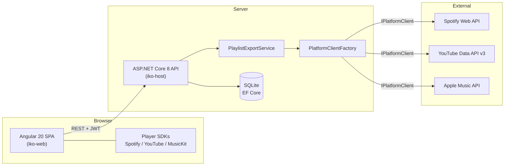

# iko

A web app for managing your music across streaming platforms: keep playlists in one place, browse connected Spotify / YouTube / Apple Music libraries, play tracks right in the browser, and export any playlist to a connected platform.

## Features

- **Unified playlists** — create playlists in iko, mix tracks from different platforms, reorder with drag & drop, upload custom covers.
- **Library browsing** — view playlists and tracks from connected Spotify, YouTube and Apple Music accounts.
- **Cross-platform search** — one query searches all connected platforms at once.
- **In-browser playback** — Spotify Web Playback SDK, YouTube IFrame API and MusicKit JS behind a single player bar (shuffle, repeat, seek, volume).
- **Playlist export** — recreate an iko playlist on any connected platform; tracks from other platforms are matched by title + artist, unmatched ones are reported.
- **Accounts** — email/password registration with JWT auth; platform accounts connected via OAuth 2.0 (Spotify, YouTube) or a MusicKit user token (Apple Music).

## Architecture



All three platform integrations implement a single `IPlatformClient` interface (search, library, playlist creation) and are resolved per request through `PlatformClientFactory`. Unhandled errors are mapped by a global `IExceptionHandler` to the API's uniform `{ data, error }` envelope; Serilog writes structured logs to console and rolling files.

## Tech stack

| Layer | Technology |
|---|---|
| Frontend | Angular 20, TypeScript, Tailwind CSS 4, spartan/ui, ngx-sonner |
| Backend | ASP.NET Core 8, EF Core 8 (SQLite), Serilog, JWT bearer auth, BCrypt |
| Testing | xUnit + Moq + WebApplicationFactory (backend), Karma/Jasmine (frontend) |

## Repository structure

```
iko-host/        ASP.NET Core API (controllers, platform clients, EF Core, migrations)
iko-host.Tests/  xUnit tests: unit (clients, export service) + integration (in-memory API)
iko-web/         Angular SPA
docs/            Design specs and implementation plans
```

## Getting started

### Prerequisites

- .NET SDK 8.0+
- Node.js 20+ and npm
- API credentials for the platforms you want to use (see table below)

### 1. Configure secrets

Copy `.env.example` to `iko-host/.env` and fill in the values:

| Variable | Where to get it |
|---|---|
| `SPOTIFY_CLIENT_ID` / `SPOTIFY_CLIENT_SECRET` | [Spotify Developer Dashboard](https://developer.spotify.com/dashboard) — add `http://127.0.0.1:5000/api/accounts/callback/spotify` as a redirect URI |
| `YOUTUBE_CLIENT_ID` / `YOUTUBE_CLIENT_SECRET` | Google Cloud Console OAuth client — redirect URI `http://127.0.0.1:5000/api/accounts/callback/youtube` |
| `YOUTUBE_API_KEY` | Google Cloud Console API key (YouTube Data API v3) — used for search without a connected account |
| `APPLE_DEVELOPER_TOKEN` | Apple Developer MusicKit key (optional — Apple Music features are skipped without it) |

### 2. Run the backend

```bash
cd iko-host
dotnet run
```

The API starts on `http://localhost:5000`. The SQLite database is created automatically by EF Core migrations on first run. Swagger UI is available at `/swagger` in development.

### 3. Run the frontend

```bash
cd iko-web
npm install
npm start
```

Open `http://localhost:4200`, register an account and connect your platforms on the Settings page.

## Docker

The backend ships with a Dockerfile:

```bash
docker build -t iko-host -f iko-host/Dockerfile .
docker run --env-file iko-host/.env -p 5000:8080 iko-host
```

The frontend is built separately (`npm run build` in `iko-web`) and can be served by any static file server.

## Deployment

The live instance runs a native deploy on Ubuntu (Kestrel behind nginx, managed by a
`systemd` unit, TLS via Let's Encrypt). To ship a new build:

```bash
./deploy.sh
```

It builds the backend and frontend locally, uploads the artifacts over the `awqserver`
SSH alias, restarts the `iko-api` service and runs a smoke test. It never touches the
server `.env` (which holds `Jwt__Key`, `App__*` and platform secrets) or the API
directory's runtime data (`iko.db`, logs, uploaded covers).

Full server layout, SSH setup for a new machine, secrets, TLS and common ops are
documented in [docs/DEPLOYMENT.md](docs/DEPLOYMENT.md).

## Testing

```bash
# Backend: unit + integration (no external API calls)
dotnet test

# Frontend
cd iko-web
npx ng test --watch=false --browsers=ChromeHeadless
```

## API overview

| Method & path | Description |
|---|---|
| `POST /api/auth/register`, `POST /api/auth/login`, `GET /api/auth/me` | Email/password auth, JWT issuance |
| `GET /api/accounts`, `DELETE /api/accounts/{platform}` | Connected platform accounts |
| `GET /api/accounts/connect/{platform}`, `GET /api/accounts/callback/{platform}` | OAuth connection flow |
| `GET /api/accounts/token/{platform}` | Platform access token (refreshes when expired) |
| `GET/POST/PUT/DELETE /api/iko-playlists[...]` | Playlist CRUD, tracks, reorder, cover upload |
| `POST /api/iko-playlists/{id}/export` | Export a playlist to a connected platform |
| `GET /api/library/playlists/{platform}[...]` | Browse a connected platform's library |
| `GET /api/search?q=...` | Cross-platform track search |

## Future work

- SoundCloud and Deezer integrations (the `Platform` enum already reserves slots)
- Playlist sharing between iko users
- Password reset and email confirmation
- Production deployment with secret rotation and HTTPS
