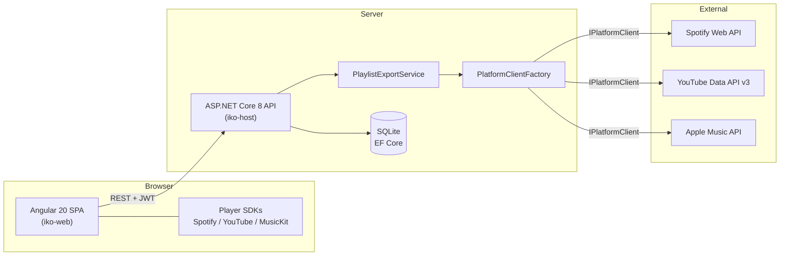

# iko: tests and README — Implementation Plan

> **For agentic workers:** REQUIRED SUB-SKILL: Use superpowers:subagent-driven-development (recommended) or superpowers:executing-plans to implement this plan task-by-task. Steps use checkbox (`- [ ]`) syntax for tracking.

**Goal:** Add `iko-host.Tests` (xUnit unit + integration tests, with `PlaylistExportService` extracted for testability), make `ng test` pass with two new service specs, and write a proper root README plus `.env.example`.

**Architecture:** Unit tests mock `HttpMessageHandler` (platform clients) and `IPlatformClient` (export service); integration tests boot the real app via `WebApplicationFactory<Program>` with SQLite in-memory replacing the file DB. No test touches a real external API. The export matching logic moves from `IkoPlaylistsController` into `Services/PlaylistExportService` so it can be unit-tested with mocked clients.

**Tech Stack:** xUnit, Moq, Microsoft.AspNetCore.Mvc.Testing, SQLite in-memory, Angular TestBed + HttpTestingController (Karma/Jasmine, headless Chrome).

**Spec:** `docs/superpowers/specs/2026-06-11-tests-and-readme-design.md`

---

### Task 1: Test project scaffolding

**Files:**
- Create: `iko-host.Tests/iko-host.Tests.csproj` (via `dotnet new`)
- Create: `iko-host.Tests/TestHelpers/StubHttpMessageHandler.cs`
- Create: `iko-host.Tests/TestHelpers/FakePlatformEnv.cs`
- Modify: `iko-host/Program.cs` (append partial class)
- Modify: `iko.sln` (via `dotnet sln add`)

- [ ] **Step 1: Scaffold the project**

Run from `c:\awoq\iko`:
```bash
dotnet new xunit -o iko-host.Tests -n iko-host.Tests
dotnet sln iko.sln add iko-host.Tests/iko-host.Tests.csproj
dotnet add iko-host.Tests/iko-host.Tests.csproj reference iko-host/iko-host.csproj
dotnet add iko-host.Tests/iko-host.Tests.csproj package Moq
dotnet add iko-host.Tests/iko-host.Tests.csproj package Microsoft.AspNetCore.Mvc.Testing --version 8.0.11
dotnet add iko-host.Tests/iko-host.Tests.csproj package Microsoft.EntityFrameworkCore.Sqlite --version 8.0.11
```
Ensure `<TargetFramework>net8.0</TargetFramework>` in the new csproj (edit if the template generated a different one). Delete the template's `UnitTest1.cs`. The generated project name contains a dash, so the default root namespace will be `iko_host.Tests` — keep that convention in all test files.

- [ ] **Step 2: Make Program visible to WebApplicationFactory**

Append to the very end of `iko-host/Program.cs`:
```csharp
// Exposes the implicit Program class to WebApplicationFactory in iko-host.Tests.
public partial class Program { }
```

- [ ] **Step 3: Shared helpers**

`iko-host.Tests/TestHelpers/StubHttpMessageHandler.cs`:
```csharp
namespace iko_host.Tests.TestHelpers;

/// <summary>Returns canned responses chosen by a per-request responder.</summary>
public class StubHttpMessageHandler : HttpMessageHandler
{
    private readonly Func<HttpRequestMessage, HttpResponseMessage> _responder;

    public List<HttpRequestMessage> Requests { get; } = new();

    public StubHttpMessageHandler(Func<HttpRequestMessage, HttpResponseMessage> responder)
    {
        _responder = responder;
    }

    public static StubHttpMessageHandler RespondingWith(System.Net.HttpStatusCode status, string json) =>
        new(_ => Json(status, json));

    public static HttpResponseMessage Json(System.Net.HttpStatusCode status, string json) =>
        new(status) { Content = new StringContent(json, System.Text.Encoding.UTF8, "application/json") };

    protected override Task<HttpResponseMessage> SendAsync(
        HttpRequestMessage request, CancellationToken cancellationToken)
    {
        Requests.Add(request);
        return Task.FromResult(_responder(request));
    }
}
```

`iko-host.Tests/TestHelpers/FakePlatformEnv.cs`:
```csharp
namespace iko_host.Tests.TestHelpers;

/// <summary>Platform client constructors read credentials from env vars; set fakes once.</summary>
public static class FakePlatformEnv
{
    public static void Set()
    {
        Environment.SetEnvironmentVariable("SPOTIFY_CLIENT_ID", "test-spotify-id");
        Environment.SetEnvironmentVariable("SPOTIFY_CLIENT_SECRET", "test-spotify-secret");
        Environment.SetEnvironmentVariable("YOUTUBE_CLIENT_ID", "test-youtube-id");
        Environment.SetEnvironmentVariable("YOUTUBE_CLIENT_SECRET", "test-youtube-secret");
        Environment.SetEnvironmentVariable("YOUTUBE_API_KEY", "test-youtube-key");
        Environment.SetEnvironmentVariable("APPLE_DEVELOPER_TOKEN", "test-apple-token");
    }
}
```

- [ ] **Step 4: Verify**

Run: `dotnet test iko-host.Tests/iko-host.Tests.csproj --nologo`
Expected: builds, 0 tests, exit code 0.

- [ ] **Step 5: Commit**

```bash
git add -A
git commit -m "test: scaffold iko-host.Tests project"
```

---

### Task 2: PlatformClientFactory unit tests

**Files:**
- Create: `iko-host.Tests/Unit/PlatformClientFactoryTests.cs`

- [ ] **Step 1: Write the tests**

```csharp
namespace iko_host.Tests.Unit;

using iko_host.Clients;
using iko_host.Exceptions;
using iko_host.Models;
using Moq;
using Xunit;

public class PlatformClientFactoryTests
{
    private static IPlatformClient ClientFor(Platform platform)
    {
        var mock = new Mock<IPlatformClient>();
        mock.SetupGet(c => c.Platform).Returns(platform);
        return mock.Object;
    }

    private static PlatformClientFactory Factory() => new(new[]
    {
        ClientFor(Platform.Spotify), ClientFor(Platform.YouTube), ClientFor(Platform.AppleMusic)
    });

    [Theory]
    [InlineData(Platform.Spotify)]
    [InlineData(Platform.YouTube)]
    [InlineData(Platform.AppleMusic)]
    public void Get_returns_client_for_supported_platform(Platform platform)
    {
        Assert.Equal(platform, Factory().Get(platform).Platform);
    }

    [Theory]
    [InlineData(Platform.SoundCloud)]
    [InlineData(Platform.Deezer)]
    public void Get_throws_for_unsupported_platform(Platform platform)
    {
        var ex = Assert.Throws<UnsupportedPlatformException>(() => Factory().Get(platform));
        Assert.Equal(platform, ex.Platform);
    }
}
```

- [ ] **Step 2: Run**

Run: `dotnet test iko-host.Tests/iko-host.Tests.csproj --nologo`
Expected: 5 tests pass.

- [ ] **Step 3: Commit**

```bash
git add iko-host.Tests
git commit -m "test: platform client factory resolution"
```

---

### Task 3: Extract PlaylistExportService (TDD)

**Files:**
- Test: `iko-host.Tests/Unit/PlaylistExportServiceTests.cs`
- Create: `iko-host/Services/PlaylistExportService.cs`
- Modify: `iko-host/Controllers/IkoPlaylistsController.cs` (Export action + ctor)
- Modify: `iko-host/Program.cs` (DI registration)

- [ ] **Step 1: Write the failing tests**

```csharp
namespace iko_host.Tests.Unit;

using iko_host.Clients;
using iko_host.Models;
using iko_host.Services;
using Microsoft.Extensions.Logging.Abstractions;
using Moq;
using Xunit;

public class PlaylistExportServiceTests
{
    private readonly Mock<IPlatformClient> _spotify = new();

    private PlaylistExportService Service()
    {
        _spotify.SetupGet(c => c.Platform).Returns(Platform.Spotify);
        _spotify.Setup(c => c.CreatePlaylist(It.IsAny<IEnumerable<string>>(), It.IsAny<string>(), It.IsAny<string?>()))
            .ReturnsAsync(("https://spotify/playlist/1", (string?)"https://img"));
        var factory = new PlatformClientFactory(new[] { _spotify.Object });
        return new PlaylistExportService(factory, NullLogger<PlaylistExportService>.Instance);
    }

    private static IkoPlaylistTrack Track(Platform platform, string id, string name = "Song", string artist = "Artist") =>
        new() { Platform = platform, PlatformTrackId = id, Name = name, Artist = artist };

    [Fact]
    public async Task Same_platform_tracks_are_used_directly_without_search()
    {
        var service = Service();
        var tracks = new[] { Track(Platform.Spotify, "sp-1"), Track(Platform.Spotify, "sp-2") };

        var outcome = await service.ExportAsync(tracks, "My List", Platform.Spotify, "token");

        Assert.NotNull(outcome);
        Assert.Equal(2, outcome!.MatchedCount);
        Assert.Empty(outcome.UnmatchedTracks);
        _spotify.Verify(c => c.SearchForTrack(It.IsAny<string>(), It.IsAny<string>(), It.IsAny<string?>()), Times.Never);
        _spotify.Verify(c => c.CreatePlaylist(
            It.Is<IEnumerable<string>>(ids => ids.SequenceEqual(new[] { "sp-1", "sp-2" })),
            "token", "My List"), Times.Once);
    }

    [Fact]
    public async Task Cross_platform_tracks_are_searched_and_unmatched_collected()
    {
        var service = Service();
        _spotify.Setup(c => c.SearchForTrack("Found", "A", "token"))
            .ReturnsAsync(new TrackModel { Platform = Platform.Spotify, PlatformTrackId = "found-id" });
        _spotify.Setup(c => c.SearchForTrack("Missing", "B", "token"))
            .ReturnsAsync((TrackModel?)null);
        var tracks = new[]
        {
            Track(Platform.YouTube, "yt-1", "Found", "A"),
            Track(Platform.YouTube, "yt-2", "Missing", "B")
        };

        var outcome = await service.ExportAsync(tracks, "Mixed", Platform.Spotify, "token");

        Assert.NotNull(outcome);
        Assert.Equal(1, outcome!.MatchedCount);
        Assert.Equal(2, outcome.TotalCount);
        var unmatched = Assert.Single(outcome.UnmatchedTracks);
        Assert.Equal("Missing", unmatched.Name);
        Assert.Equal("B", unmatched.Artist);
        _spotify.Verify(c => c.CreatePlaylist(
            It.Is<IEnumerable<string>>(ids => ids.SequenceEqual(new[] { "found-id" })),
            "token", "Mixed"), Times.Once);
    }

    [Fact]
    public async Task Returns_null_and_creates_nothing_when_no_track_matches()
    {
        var service = Service();
        _spotify.Setup(c => c.SearchForTrack(It.IsAny<string>(), It.IsAny<string>(), It.IsAny<string?>()))
            .ReturnsAsync((TrackModel?)null);
        var tracks = new[] { Track(Platform.YouTube, "yt-1") };

        var outcome = await service.ExportAsync(tracks, "Empty", Platform.Spotify, "token");

        Assert.Null(outcome);
        _spotify.Verify(c => c.CreatePlaylist(It.IsAny<IEnumerable<string>>(), It.IsAny<string>(), It.IsAny<string?>()), Times.Never);
    }
}
```

- [ ] **Step 2: Run to verify failure**

Run: `dotnet test iko-host.Tests/iko-host.Tests.csproj --nologo`
Expected: compile error — `iko_host.Services.PlaylistExportService` does not exist.

- [ ] **Step 3: Implement the service**

`iko-host/Services/PlaylistExportService.cs`:
```csharp
namespace iko_host.Services;

using iko_host.Clients;
using iko_host.Models;

public record UnmatchedTrack(string Name, string Artist);

public record ExportOutcome(
    string Url,
    string? ImageUrl,
    int MatchedCount,
    int TotalCount,
    List<UnmatchedTrack> UnmatchedTracks);

public class PlaylistExportService
{
    private readonly PlatformClientFactory _clients;
    private readonly ILogger<PlaylistExportService> _logger;

    public PlaylistExportService(PlatformClientFactory clients, ILogger<PlaylistExportService> logger)
    {
        _clients = clients;
        _logger = logger;
    }

    /// <summary>
    /// Matches tracks on the target platform and creates a playlist there.
    /// Returns null when no track could be matched (nothing is created).
    /// </summary>
    public async Task<ExportOutcome?> ExportAsync(
        IReadOnlyList<IkoPlaylistTrack> tracks,
        string playlistName,
        Platform targetPlatform,
        string accessToken)
    {
        var client = _clients.Get(targetPlatform);
        var matchedIds = new List<string>();
        var unmatched = new List<UnmatchedTrack>();

        foreach (var track in tracks)
        {
            if (track.Platform == targetPlatform)
            {
                matchedIds.Add(track.PlatformTrackId);
                continue;
            }

            var found = await client.SearchForTrack(track.Name, track.Artist, accessToken);
            if (found?.PlatformTrackId != null)
                matchedIds.Add(found.PlatformTrackId);
            else
                unmatched.Add(new UnmatchedTrack(track.Name, track.Artist));
        }

        if (matchedIds.Count == 0)
            return null;

        var (url, imageUrl) = await client.CreatePlaylist(matchedIds, accessToken, playlistName);

        _logger.LogInformation(
            "Exported playlist {Name} to {Platform}: {Matched}/{Total} tracks",
            playlistName, targetPlatform, matchedIds.Count, tracks.Count);

        return new ExportOutcome(url, imageUrl, matchedIds.Count, tracks.Count, unmatched);
    }
}
```

- [ ] **Step 4: Delegate from the controller**

In `iko-host/Controllers/IkoPlaylistsController.cs`:
- Add `using iko_host.Services;`; replace the `PlatformClientFactory _clients` field/ctor param with `PlaylistExportService _exportService` (the controller no longer needs the factory).
- Replace the body of `Export` after the `account == null` check with:
```csharp
        var outcome = await _exportService.ExportAsync(
            playlist.Tracks.ToList(), playlist.Name, request.TargetPlatform, account.AccessToken);

        if (outcome == null)
            return BadRequest(new { data = (object?)null, error = "No tracks could be matched on the target platform" });

        return Ok(new { data = outcome, error = (string?)null });
```
(The `ExportOutcome` record serializes to the same camelCase JSON shape the frontend `ExportResult` expects. The `_logger` field stays for other actions; remove it only if nothing else uses it.)

In `iko-host/Program.cs` add next to the factory registration:
```csharp
builder.Services.AddTransient<PlaylistExportService>();
```
with `using iko_host.Services;` at the top.

- [ ] **Step 5: Run all tests + build**

Run: `dotnet test iko-host.Tests/iko-host.Tests.csproj --nologo` → 8 tests pass.
Run: `dotnet build iko-host/iko-host.csproj --nologo -v q` → 0 errors.

- [ ] **Step 6: Commit**

```bash
git add -A iko-host iko-host.Tests
git commit -m "refactor: extract PlaylistExportService with unit tests"
```

---

### Task 4: Platform client unit tests (mocked HTTP)

**Files:**
- Create: `iko-host.Tests/Unit/SpotifyClientTests.cs`
- Create: `iko-host.Tests/Unit/YouTubeClientTests.cs`
- Create: `iko-host.Tests/Unit/AppleMusicClientTests.cs`

- [ ] **Step 1: SpotifyClientTests**

```csharp
namespace iko_host.Tests.Unit;

using System.Net;
using iko_host.Clients;
using iko_host.Exceptions;
using iko_host.Models;
using iko_host.Tests.TestHelpers;
using Microsoft.Extensions.Logging.Abstractions;
using Xunit;

public class SpotifyClientTests
{
    public SpotifyClientTests() => FakePlatformEnv.Set();

    private static SpotifyClient Client(StubHttpMessageHandler handler) =>
        new(new HttpClient(handler), NullLogger<SpotifyClient>.Instance);

    [Fact]
    public async Task SearchForTrack_parses_first_result()
    {
        var handler = StubHttpMessageHandler.RespondingWith(HttpStatusCode.OK,
            """{"tracks":{"items":[{"id":"track-1","duration_ms":215000,"album":{"images":[{"url":"https://img/cover"}]}}]}}""");

        var track = await Client(handler).SearchForTrack("Song", "Artist", "user-token");

        Assert.NotNull(track);
        Assert.Equal("track-1", track!.PlatformTrackId);
        Assert.Equal(Platform.Spotify, track.Platform);
        Assert.Equal(215000, track.DurationMs);
        Assert.Equal("https://img/cover", track.ImageUrl);
    }

    [Fact]
    public async Task SearchForTrack_returns_null_when_api_fails()
    {
        var handler = StubHttpMessageHandler.RespondingWith(HttpStatusCode.TooManyRequests, "{}");

        var track = await Client(handler).SearchForTrack("Song", "Artist", "user-token");

        Assert.Null(track);
    }

    [Fact]
    public async Task SearchForTrack_returns_null_when_no_items()
    {
        var handler = StubHttpMessageHandler.RespondingWith(HttpStatusCode.OK,
            """{"tracks":{"items":[]}}""");

        Assert.Null(await Client(handler).SearchForTrack("Song", "Artist", "user-token"));
    }

    [Fact]
    public async Task GetPlaylists_maps_summary_fields()
    {
        var handler = StubHttpMessageHandler.RespondingWith(HttpStatusCode.OK,
            """{"items":[{"id":"pl-1","name":"Mix","images":[{"url":"https://img/p"}],"tracks":{"total":12}}]}""");

        var playlists = await Client(handler).GetPlaylists("user-token");

        var pl = Assert.Single(playlists);
        Assert.Equal("pl-1", pl.Id);
        Assert.Equal("Mix", pl.Name);
        Assert.Equal("https://img/p", pl.ImageUrl);
        Assert.Equal(12, pl.TrackCount);
    }

    [Fact]
    public async Task GetPlaylists_throws_PlatformApiException_on_http_error()
    {
        var handler = StubHttpMessageHandler.RespondingWith(HttpStatusCode.Unauthorized, "{}");

        var ex = await Assert.ThrowsAsync<PlatformApiException>(() => Client(handler).GetPlaylists("expired"));
        Assert.Equal(Platform.Spotify, ex.Platform);
        Assert.Equal(401, ex.StatusCode);
    }

    [Fact]
    public async Task GetPlaylistTracks_maps_library_tracks()
    {
        var handler = StubHttpMessageHandler.RespondingWith(HttpStatusCode.OK,
            """{"items":[{"track":{"id":"t-1","name":"Tune","duration_ms":1000,"album":{"images":[{"url":"https://img/t"}]},"artists":[{"name":"A"},{"name":"B"}]}}]}""");

        var tracks = await Client(handler).GetPlaylistTracks("pl-1", "user-token");

        var t = Assert.Single(tracks);
        Assert.Equal("t-1", t.PlatformTrackId);
        Assert.Equal("A, B", t.Artist);
        Assert.Equal("Spotify", t.Platform);
    }
}
```

- [ ] **Step 2: YouTubeClientTests**

```csharp
namespace iko_host.Tests.Unit;

using System.Net;
using iko_host.Clients;
using iko_host.Exceptions;
using iko_host.Models;
using iko_host.Tests.TestHelpers;
using Microsoft.Extensions.Logging.Abstractions;
using Xunit;

public class YouTubeClientTests
{
    public YouTubeClientTests() => FakePlatformEnv.Set();

    private static YouTubeClient Client(StubHttpMessageHandler handler) =>
        new(new HttpClient(handler), NullLogger<YouTubeClient>.Instance);

    private static StubHttpMessageHandler SearchHandler() => new(req =>
        req.RequestUri!.AbsolutePath.Contains("/videos")
            ? StubHttpMessageHandler.Json(HttpStatusCode.OK,
                """{"items":[{"id":"vid-1","contentDetails":{"duration":"PT3M20S"}}]}""")
            : StubHttpMessageHandler.Json(HttpStatusCode.OK,
                """{"items":[{"id":{"videoId":"vid-1"},"snippet":{"thumbnails":{"medium":{"url":"https://img/yt"}}}}]}"""));

    [Fact]
    public async Task SearchForTrack_parses_result_and_duration()
    {
        var track = await Client(SearchHandler()).SearchForTrack("Song", "Artist", "oauth-token");

        Assert.NotNull(track);
        Assert.Equal("vid-1", track!.PlatformTrackId);
        Assert.Equal(Platform.YouTube, track.Platform);
        Assert.Equal(200000, track.DurationMs); // PT3M20S
    }

    [Fact]
    public async Task SearchForTrack_falls_back_to_api_key_without_token()
    {
        var handler = SearchHandler();

        var track = await Client(handler).SearchForTrack("Song", "Artist", accessToken: null);

        Assert.NotNull(track);
        Assert.Contains("key=test-youtube-key", handler.Requests[0].RequestUri!.Query);
    }

    [Fact]
    public async Task SearchForTrack_returns_null_without_token_and_api_key()
    {
        Environment.SetEnvironmentVariable("YOUTUBE_API_KEY", null);
        try
        {
            var handler = SearchHandler();
            Assert.Null(await Client(handler).SearchForTrack("Song", "Artist", accessToken: null));
            Assert.Empty(handler.Requests);
        }
        finally
        {
            FakePlatformEnv.Set();
        }
    }

    [Fact]
    public async Task SearchForTrack_survives_duration_endpoint_failure()
    {
        var handler = new StubHttpMessageHandler(req =>
            req.RequestUri!.AbsolutePath.Contains("/videos")
                ? StubHttpMessageHandler.Json(HttpStatusCode.InternalServerError, "boom")
                : StubHttpMessageHandler.Json(HttpStatusCode.OK,
                    """{"items":[{"id":{"videoId":"vid-1"},"snippet":{"thumbnails":{"medium":{"url":"https://img/yt"}}}}]}"""));

        var track = await Client(handler).SearchForTrack("Song", "Artist", "oauth-token");

        Assert.NotNull(track);
        Assert.Equal(0, track!.DurationMs);
    }

    [Fact]
    public async Task GetPlaylists_throws_PlatformApiException_on_http_error()
    {
        var handler = StubHttpMessageHandler.RespondingWith(HttpStatusCode.Forbidden, "{}");

        var ex = await Assert.ThrowsAsync<PlatformApiException>(() => Client(handler).GetPlaylists("expired"));
        Assert.Equal(Platform.YouTube, ex.Platform);
        Assert.Equal(403, ex.StatusCode);
    }
}
```

- [ ] **Step 3: AppleMusicClientTests**

```csharp
namespace iko_host.Tests.Unit;

using System.Net;
using iko_host.Clients;
using iko_host.Exceptions;
using iko_host.Models;
using iko_host.Tests.TestHelpers;
using Microsoft.Extensions.Logging.Abstractions;
using Xunit;

public class AppleMusicClientTests
{
    public AppleMusicClientTests() => FakePlatformEnv.Set();

    private static AppleMusicClient Client(StubHttpMessageHandler handler) =>
        new(new HttpClient(handler), NullLogger<AppleMusicClient>.Instance);

    [Fact]
    public async Task SearchForTrack_returns_null_without_user_token()
    {
        var handler = StubHttpMessageHandler.RespondingWith(HttpStatusCode.OK, "{}");

        Assert.Null(await Client(handler).SearchForTrack("Song", "Artist", accessToken: null));
        Assert.Empty(handler.Requests);
    }

    [Fact]
    public async Task SearchForTrack_parses_song_and_expands_artwork_template()
    {
        var handler = StubHttpMessageHandler.RespondingWith(HttpStatusCode.OK,
            """{"results":{"songs":{"data":[{"id":"song-1","attributes":{"durationInMillis":180000,"artwork":{"url":"https://img/{w}x{h}.jpg"}}}]}}}""");

        var track = await Client(handler).SearchForTrack("Song", "Artist", "user-token");

        Assert.NotNull(track);
        Assert.Equal("song-1", track!.PlatformTrackId);
        Assert.Equal(Platform.AppleMusic, track.Platform);
        Assert.Equal("https://img/300x300.jpg", track.ImageUrl);
    }

    [Fact]
    public async Task GetPlaylistTracks_throws_PlatformApiException_on_http_error()
    {
        var handler = StubHttpMessageHandler.RespondingWith(HttpStatusCode.Unauthorized, "{}");

        var ex = await Assert.ThrowsAsync<PlatformApiException>(
            () => Client(handler).GetPlaylistTracks("pl-1", "bad-token"));
        Assert.Equal(Platform.AppleMusic, ex.Platform);
    }
}
```

- [ ] **Step 4: Run + Commit**

Run: `dotnet test iko-host.Tests/iko-host.Tests.csproj --nologo` → all pass (8 + 14 = 22).

```bash
git add iko-host.Tests
git commit -m "test: platform clients against mocked HTTP"
```

---

### Task 5: GlobalExceptionHandler unit tests

**Files:**
- Create: `iko-host.Tests/Unit/GlobalExceptionHandlerTests.cs`

- [ ] **Step 1: Write the tests**

```csharp
namespace iko_host.Tests.Unit;

using System.Text.Json;
using iko_host.Exceptions;
using iko_host.Infrastructure;
using iko_host.Models;
using Microsoft.AspNetCore.Http;
using Microsoft.Extensions.Logging.Abstractions;
using Xunit;

public class GlobalExceptionHandlerTests
{
    private static async Task<(int Status, JsonElement Body)> Handle(Exception exception)
    {
        var handler = new GlobalExceptionHandler(NullLogger<GlobalExceptionHandler>.Instance);
        var context = new DefaultHttpContext();
        context.Response.Body = new MemoryStream();

        var handled = await handler.TryHandleAsync(context, exception, CancellationToken.None);
        Assert.True(handled);

        context.Response.Body.Position = 0;
        var body = await JsonDocument.ParseAsync(context.Response.Body);
        return (context.Response.StatusCode, body.RootElement.Clone());
    }

    [Fact]
    public async Task Unsupported_platform_maps_to_400()
    {
        var (status, body) = await Handle(new UnsupportedPlatformException(Platform.Deezer));

        Assert.Equal(400, status);
        Assert.Contains("Deezer", body.GetProperty("error").GetString());
        Assert.Equal(JsonValueKind.Null, body.GetProperty("data").ValueKind);
    }

    [Fact]
    public async Task Platform_api_error_maps_to_502_with_platform_name()
    {
        var (status, body) = await Handle(new PlatformApiException(Platform.Spotify, "rate limited", 429));

        Assert.Equal(502, status);
        Assert.Contains("Spotify", body.GetProperty("error").GetString());
    }

    [Fact]
    public async Task Unknown_exception_maps_to_500_without_details()
    {
        var (status, body) = await Handle(new InvalidOperationException("secret internals"));

        Assert.Equal(500, status);
        Assert.DoesNotContain("secret", body.GetProperty("error").GetString());
    }
}
```

- [ ] **Step 2: Run + Commit**

Run: `dotnet test iko-host.Tests/iko-host.Tests.csproj --nologo` → all pass (25).

```bash
git add iko-host.Tests
git commit -m "test: global exception handler status mapping"
```

---

### Task 6: Integration test factory + Auth API tests

**Files:**
- Create: `iko-host.Tests/Integration/IkoApiFactory.cs`
- Create: `iko-host.Tests/Integration/AuthApiTests.cs`

- [ ] **Step 1: WebApplicationFactory with SQLite in-memory**

`iko-host.Tests/Integration/IkoApiFactory.cs`:
```csharp
namespace iko_host.Tests.Integration;

using iko_host.Data;
using iko_host.Tests.TestHelpers;
using Microsoft.AspNetCore.Hosting;
using Microsoft.AspNetCore.Mvc.Testing;
using Microsoft.Data.Sqlite;
using Microsoft.EntityFrameworkCore;
using Microsoft.Extensions.DependencyInjection;

public class IkoApiFactory : WebApplicationFactory<Program>
{
    private readonly SqliteConnection _connection = new("DataSource=:memory:");

    protected override void ConfigureWebHost(IWebHostBuilder builder)
    {
        FakePlatformEnv.Set();
        _connection.Open();

        builder.UseEnvironment("Development");
        builder.ConfigureServices(services =>
        {
            var descriptor = services.Single(d => d.ServiceType == typeof(DbContextOptions<AppDbContext>));
            services.Remove(descriptor);
            services.AddDbContext<AppDbContext>(options => options.UseSqlite(_connection));
        });
    }

    protected override void Dispose(bool disposing)
    {
        base.Dispose(disposing);
        _connection.Dispose();
    }
}
```

- [ ] **Step 2: Auth API tests**

`iko-host.Tests/Integration/AuthApiTests.cs`:
```csharp
namespace iko_host.Tests.Integration;

using System.Net;
using System.Net.Http.Headers;
using System.Net.Http.Json;
using System.Text.Json;
using Xunit;

public class AuthApiTests : IClassFixture<IkoApiFactory>
{
    private readonly HttpClient _client;

    public AuthApiTests(IkoApiFactory factory) => _client = factory.CreateClient();

    private static async Task<JsonElement> Body(HttpResponseMessage response) =>
        (await response.Content.ReadFromJsonAsync<JsonElement>());

    private async Task<string> RegisterAndGetToken(string email)
    {
        var response = await _client.PostAsJsonAsync("/api/auth/register",
            new { email, password = "password123" });
        response.EnsureSuccessStatusCode();
        return (await Body(response)).GetProperty("data").GetProperty("token").GetString()!;
    }

    [Fact]
    public async Task Register_returns_token()
    {
        var token = await RegisterAndGetToken("reg@test.com");
        Assert.False(string.IsNullOrWhiteSpace(token));
    }

    [Fact]
    public async Task Register_with_duplicate_email_returns_409()
    {
        await RegisterAndGetToken("dup@test.com");
        var response = await _client.PostAsJsonAsync("/api/auth/register",
            new { email = "dup@test.com", password = "password123" });

        Assert.Equal(HttpStatusCode.Conflict, response.StatusCode);
    }

    [Theory]
    [InlineData("not-an-email", "password123")]
    [InlineData("ok@test.com", "short")]
    [InlineData("", "password123")]
    public async Task Register_with_invalid_input_returns_400(string email, string password)
    {
        var response = await _client.PostAsJsonAsync("/api/auth/register", new { email, password });

        Assert.Equal(HttpStatusCode.BadRequest, response.StatusCode);
    }

    [Fact]
    public async Task Login_with_wrong_password_returns_401()
    {
        await RegisterAndGetToken("login@test.com");
        var response = await _client.PostAsJsonAsync("/api/auth/login",
            new { email = "login@test.com", password = "wrong-password" });

        Assert.Equal(HttpStatusCode.Unauthorized, response.StatusCode);
    }

    [Fact]
    public async Task Me_requires_and_accepts_bearer_token()
    {
        var anonymous = await _client.GetAsync("/api/auth/me");
        Assert.Equal(HttpStatusCode.Unauthorized, anonymous.StatusCode);

        var token = await RegisterAndGetToken("me@test.com");
        var request = new HttpRequestMessage(HttpMethod.Get, "/api/auth/me");
        request.Headers.Authorization = new AuthenticationHeaderValue("Bearer", token);
        var response = await _client.SendAsync(request);

        response.EnsureSuccessStatusCode();
        Assert.Equal("me@test.com",
            (await Body(response)).GetProperty("data").GetProperty("email").GetString());
    }
}
```

- [ ] **Step 3: Run + Commit**

Run: `dotnet test iko-host.Tests/iko-host.Tests.csproj --nologo` → all pass (25 + 7 = 32).
Note: integration tests boot the real `Program`, which calls `db.Database.Migrate()` — the in-memory SQLite gets the schema automatically. If startup fails on `DotNetEnv.Env.Load()` or Serilog file sink, those are environmental — investigate, do not skip.

```bash
git add iko-host.Tests
git commit -m "test: auth API integration tests via WebApplicationFactory"
```

---

### Task 7: Iko playlists API integration tests

**Files:**
- Create: `iko-host.Tests/Integration/IkoPlaylistsApiTests.cs`

- [ ] **Step 1: Write the tests**

```csharp
namespace iko_host.Tests.Integration;

using System.Net;
using System.Net.Http.Headers;
using System.Net.Http.Json;
using System.Text.Json;
using Xunit;

public class IkoPlaylistsApiTests : IClassFixture<IkoApiFactory>
{
    private readonly HttpClient _client;

    public IkoPlaylistsApiTests(IkoApiFactory factory) => _client = factory.CreateClient();

    private static async Task<JsonElement> Body(HttpResponseMessage response) =>
        await response.Content.ReadFromJsonAsync<JsonElement>();

    private async Task AuthorizeAsNewUser()
    {
        var email = $"{Guid.NewGuid():N}@test.com";
        var response = await _client.PostAsJsonAsync("/api/auth/register",
            new { email, password = "password123" });
        response.EnsureSuccessStatusCode();
        var token = (await Body(response)).GetProperty("data").GetProperty("token").GetString();
        _client.DefaultRequestHeaders.Authorization = new AuthenticationHeaderValue("Bearer", token);
    }

    private async Task<string> CreatePlaylist(string name)
    {
        var response = await _client.PostAsJsonAsync("/api/iko-playlists", new { name });
        response.EnsureSuccessStatusCode();
        return (await Body(response)).GetProperty("data").GetProperty("id").GetString()!;
    }

    private static object Track(string id, string name = "Song") => new
    {
        platform = 0, platformTrackId = id, name, artist = "Artist",
        imageUrl = (string?)null, durationMs = 1000
    };

    [Fact]
    public async Task Endpoints_require_authentication()
    {
        var response = await _client.GetAsync("/api/iko-playlists");
        Assert.Equal(HttpStatusCode.Unauthorized, response.StatusCode);
    }

    [Fact]
    public async Task Create_list_get_round_trip()
    {
        await AuthorizeAsNewUser();
        var id = await CreatePlaylist("Road Trip");

        var list = await Body(await _client.GetAsync("/api/iko-playlists"));
        Assert.Contains(list.GetProperty("data").EnumerateArray(),
            p => p.GetProperty("id").GetString() == id);

        var detail = await Body(await _client.GetAsync($"/api/iko-playlists/{id}"));
        Assert.Equal("Road Trip", detail.GetProperty("data").GetProperty("name").GetString());
    }

    [Fact]
    public async Task Duplicate_track_returns_409()
    {
        await AuthorizeAsNewUser();
        var id = await CreatePlaylist("Dups");

        var first = await _client.PostAsJsonAsync($"/api/iko-playlists/{id}/tracks", Track("t-1"));
        first.EnsureSuccessStatusCode();
        var second = await _client.PostAsJsonAsync($"/api/iko-playlists/{id}/tracks", Track("t-1"));

        Assert.Equal(HttpStatusCode.Conflict, second.StatusCode);
    }

    [Fact]
    public async Task Reorder_persists_new_order()
    {
        await AuthorizeAsNewUser();
        var id = await CreatePlaylist("Ordered");
        var t1 = await Body(await _client.PostAsJsonAsync($"/api/iko-playlists/{id}/tracks", Track("t-1", "First")));
        var t2 = await Body(await _client.PostAsJsonAsync($"/api/iko-playlists/{id}/tracks", Track("t-2", "Second")));
        var id1 = t1.GetProperty("data").GetProperty("id").GetString();
        var id2 = t2.GetProperty("data").GetProperty("id").GetString();

        var reorder = await _client.PatchAsJsonAsync($"/api/iko-playlists/{id}/tracks/reorder",
            new { orderedIds = new[] { id2, id1 } });
        reorder.EnsureSuccessStatusCode();

        var detail = await Body(await _client.GetAsync($"/api/iko-playlists/{id}"));
        var names = detail.GetProperty("data").GetProperty("tracks").EnumerateArray()
            .Select(t => t.GetProperty("name").GetString()).ToList();
        Assert.Equal(new[] { "Second", "First" }, names);
    }

    [Fact]
    public async Task Delete_removes_playlist()
    {
        await AuthorizeAsNewUser();
        var id = await CreatePlaylist("Doomed");

        var delete = await _client.DeleteAsync($"/api/iko-playlists/{id}");
        delete.EnsureSuccessStatusCode();

        Assert.Equal(HttpStatusCode.NotFound, (await _client.GetAsync($"/api/iko-playlists/{id}")).StatusCode);
    }

    [Fact]
    public async Task Export_to_unconnected_platform_returns_400()
    {
        await AuthorizeAsNewUser();
        var id = await CreatePlaylist("Exportable");
        (await _client.PostAsJsonAsync($"/api/iko-playlists/{id}/tracks", Track("t-1"))).EnsureSuccessStatusCode();

        var response = await _client.PostAsJsonAsync($"/api/iko-playlists/{id}/export", new { targetPlatform = 0 });

        Assert.Equal(HttpStatusCode.BadRequest, response.StatusCode);
        Assert.Contains("not connected", (await Body(response)).GetProperty("error").GetString());
    }
}
```

- [ ] **Step 2: Run + Commit**

Run: `dotnet test --nologo` (from repo root, runs the whole solution) → all pass (38).

```bash
git add iko-host.Tests
git commit -m "test: iko playlists API integration tests"
```

---

### Task 8: Angular service specs

**Files:**
- Create: `iko-web/src/app/services/api.service.spec.ts`
- Create: `iko-web/src/app/services/auth.service.spec.ts`
- Possibly fix: `iko-web/src/app/app/app.component.spec.ts`, `iko-web/src/app/header/header.component.spec.ts`

- [ ] **Step 1: Baseline run**

Run from `iko-web`: `npx ng test --watch=false --browsers=ChromeHeadless`
Expected: the 2 existing specs pass (they are minimal "should create" specs). Fix any breakage before adding new specs.

- [ ] **Step 2: api.service.spec.ts**

```typescript
import { TestBed } from '@angular/core/testing';
import { provideHttpClient } from '@angular/common/http';
import { provideHttpClientTesting, HttpTestingController } from '@angular/common/http/testing';
import { ApiService } from './api.service';
import { environment } from '../../environments/environment';

describe('ApiService', () => {
  let service: ApiService;
  let http: HttpTestingController;

  beforeEach(() => {
    TestBed.configureTestingModule({
      providers: [provideHttpClient(), provideHttpClientTesting()]
    });
    service = TestBed.inject(ApiService);
    http = TestBed.inject(HttpTestingController);
  });

  afterEach(() => http.verify());

  it('maps platform names to backend enum indexes', () => {
    expect(service.platformIndex('spotify')).toBe(0);
    expect(service.platformIndex('YouTube')).toBe(1);
    expect(service.platformIndex('applemusic')).toBe(2);
    expect(service.platformIndex('unknown')).toBe(0);
  });

  it('requests iko playlists', () => {
    service.getIkoPlaylists().subscribe();

    const req = http.expectOne(`${environment.apiUrl}/iko-playlists`);
    expect(req.request.method).toBe('GET');
    req.flush({ data: [], error: null });
  });

  it('exports a playlist with the platform index in the body', () => {
    service.exportIkoPlaylist('pl-1', 'youtube').subscribe();

    const req = http.expectOne(`${environment.apiUrl}/iko-playlists/pl-1/export`);
    expect(req.request.method).toBe('POST');
    expect(req.request.body).toEqual({ targetPlatform: 1 });
    req.flush({ data: null, error: null });
  });

  it('adds a track to a playlist', () => {
    const body = {
      platform: 0, platformTrackId: 't-1', name: 'Song',
      artist: 'Artist', imageUrl: null, durationMs: 1000
    };
    service.addTrackToPlaylist('pl-1', body).subscribe();

    const req = http.expectOne(`${environment.apiUrl}/iko-playlists/pl-1/tracks`);
    expect(req.request.body).toEqual(body);
    req.flush({ data: null, error: null });
  });
});
```

- [ ] **Step 3: auth.service.spec.ts**

```typescript
import { TestBed } from '@angular/core/testing';
import { provideHttpClient } from '@angular/common/http';
import { provideHttpClientTesting, HttpTestingController } from '@angular/common/http/testing';
import { provideRouter, Router } from '@angular/router';
import { AuthService } from './auth.service';
import { environment } from '../../environments/environment';

describe('AuthService', () => {
  let service: AuthService;
  let http: HttpTestingController;
  let router: Router;

  beforeEach(() => {
    localStorage.removeItem('iko_token');
    TestBed.configureTestingModule({
      providers: [provideHttpClient(), provideHttpClientTesting(), provideRouter([])]
    });
    service = TestBed.inject(AuthService);
    http = TestBed.inject(HttpTestingController);
    router = TestBed.inject(Router);
  });

  afterEach(() => {
    http.verify();
    localStorage.removeItem('iko_token');
  });

  it('stores the token and emits the user on login', () => {
    let email: string | undefined;
    service.currentUser$.subscribe(u => email = u?.email);

    service.login('user@test.com', 'password123').subscribe();
    http.expectOne(`${environment.apiUrl}/auth/login`)
      .flush({ data: { token: 'jwt-token', email: 'user@test.com' }, error: null });

    expect(localStorage.getItem('iko_token')).toBe('jwt-token');
    expect(email).toBe('user@test.com');
    expect(service.isLoggedIn()).toBeTrue();
  });

  it('clears the token and navigates to /login on logout', () => {
    localStorage.setItem('iko_token', 'jwt-token');
    const navigate = spyOn(router, 'navigate');

    service.logout();

    expect(localStorage.getItem('iko_token')).toBeNull();
    expect(service.isLoggedIn()).toBeFalse();
    expect(navigate).toHaveBeenCalledWith(['/login']);
  });
});
```
Note: the `AuthService` constructor calls `loadUser()` when a token exists; `localStorage.removeItem` in `beforeEach` runs before `TestBed.inject(AuthService)`, so no `/auth/me` request leaks. In the logout test the token is set after service creation — still no request.

- [ ] **Step 4: Run + Commit**

Run: `npx ng test --watch=false --browsers=ChromeHeadless`
Expected: all specs pass (2 existing + 6 new).

```bash
git add iko-web/src
git commit -m "test: angular api/auth service specs"
```

---

### Task 9: README and .env.example

**Files:**
- Create: `README.md` (repo root)
- Create: `.env.example` (repo root)
- Rewrite: `iko-web/README.md` (pointer to root)

- [ ] **Step 1: .env.example**

```
# Copy to iko-host/.env (or repo root, depending on where you run the host) and fill in real values.
# Spotify: https://developer.spotify.com/dashboard
SPOTIFY_CLIENT_ID=your_spotify_client_id
SPOTIFY_CLIENT_SECRET=your_spotify_client_secret

# Google Cloud Console (YouTube Data API v3)
YOUTUBE_CLIENT_ID=your_google_oauth_client_id
YOUTUBE_CLIENT_SECRET=your_google_oauth_client_secret
YOUTUBE_API_KEY=your_youtube_api_key

# Apple Developer (MusicKit)
APPLE_DEVELOPER_TOKEN=your_apple_developer_token
```

- [ ] **Step 2: Root README.md** — use the content below verbatim (review wording while pasting):

````markdown
# iko

A web app for managing your music across streaming platforms: keep playlists in one place, browse connected Spotify / YouTube / Apple Music libraries, play tracks right in the browser, and export any playlist to a connected platform.

## Features

- **Unified playlists** — create playlists in iko, mix tracks from different platforms, reorder with drag & drop, upload custom covers.
- **Library browsing** — view playlists and tracks from connected Spotify, YouTube and Apple Music accounts.
- **Cross-platform search** — one query searches all connected platforms at once.
- **In-browser playback** — Spotify Web Playback SDK, YouTube IFrame API and MusicKit JS behind a single player bar (shuffle, repeat, seek, volume).
- **Playlist export** — recreate an iko playlist on any connected platform; tracks from other platforms are matched by title + artist, unmatched ones are reported.
- **Accounts** — email/password registration with JWT auth; platform accounts connected via OAuth 2.0 (Spotify, YouTube) or a MusicKit user token (Apple Music).

## Architecture



All three platform integrations implement a single `IPlatformClient` interface (search, library, playlist creation) and are resolved per request through `PlatformClientFactory`. Unhandled errors are mapped by a global `IExceptionHandler` to the API's uniform `{ data, error }` envelope; Serilog writes structured logs to console and rolling files.

## Tech stack

| Layer | Technology |
|---|---|
| Frontend | Angular 20, TypeScript, Tailwind CSS 4, spartan/ui, ngx-sonner |
| Backend | ASP.NET Core 8, EF Core 8 (SQLite), Serilog, JWT bearer auth, BCrypt |
| Testing | xUnit + Moq + WebApplicationFactory (backend), Karma/Jasmine (frontend) |

## Repository structure

```
iko-host/        ASP.NET Core API (controllers, platform clients, EF Core, migrations)
iko-host.Tests/  xUnit tests: unit (clients, export service) + integration (in-memory API)
iko-web/         Angular SPA
docs/            Design specs and implementation plans
```

## Getting started

### Prerequisites

- .NET SDK 8.0+
- Node.js 20+ and npm
- API credentials for the platforms you want to use (see table below)

### 1. Configure secrets

Copy `.env.example` to `iko-host/.env` and fill in the values:

| Variable | Where to get it |
|---|---|
| `SPOTIFY_CLIENT_ID` / `SPOTIFY_CLIENT_SECRET` | [Spotify Developer Dashboard](https://developer.spotify.com/dashboard) — add `http://127.0.0.1:5000/api/accounts/callback/spotify` as a redirect URI |
| `YOUTUBE_CLIENT_ID` / `YOUTUBE_CLIENT_SECRET` | Google Cloud Console OAuth client — redirect URI `http://127.0.0.1:5000/api/accounts/callback/youtube` |
| `YOUTUBE_API_KEY` | Google Cloud Console API key (YouTube Data API v3) — used for search without a connected account |
| `APPLE_DEVELOPER_TOKEN` | Apple Developer MusicKit key (optional — Apple Music features are skipped without it) |

### 2. Run the backend

```bash
cd iko-host
dotnet run
```

The API starts on `http://localhost:5000`. The SQLite database is created automatically by EF Core migrations on first run. Swagger UI is available at `/swagger` in development.

### 3. Run the frontend

```bash
cd iko-web
npm install
npm start
```

Open `http://localhost:4200`, register an account and connect your platforms on the Settings page.

## Docker

The backend ships with a Dockerfile:

```bash
docker build -t iko-host -f iko-host/Dockerfile .
docker run --env-file iko-host/.env -p 5000:8080 iko-host
```

The frontend is built separately (`npm run build` in `iko-web`) and can be served by any static file server.

## Testing

```bash
# Backend: unit + integration (no external API calls)
dotnet test

# Frontend
cd iko-web
npx ng test --watch=false --browsers=ChromeHeadless
```

## API overview

| Method & path | Description |
|---|---|
| `POST /api/auth/register`, `POST /api/auth/login`, `GET /api/auth/me` | Email/password auth, JWT issuance |
| `GET /api/accounts`, `DELETE /api/accounts/{platform}` | Connected platform accounts |
| `GET /api/accounts/connect/{platform}`, `GET /api/accounts/callback/{platform}` | OAuth connection flow |
| `GET /api/accounts/token/{platform}` | Platform access token (refreshes when expired) |
| `GET/POST/PUT/DELETE /api/iko-playlists[...]` | Playlist CRUD, tracks, reorder, cover upload |
| `POST /api/iko-playlists/{id}/export` | Export a playlist to a connected platform |
| `GET /api/library/playlists/{platform}[...]` | Browse a connected platform's library |
| `GET /api/search?q=...` | Cross-platform track search |

## Future work

- SoundCloud and Deezer integrations (the `Platform` enum already reserves slots)
- Playlist sharing between iko users
- Password reset and email confirmation
- Production deployment with secret rotation and HTTPS
````

- [ ] **Step 3: iko-web/README.md**

Replace the whole file with:
```markdown
# iko-web

Angular frontend for **iko**. See the [root README](../README.md) for setup, architecture and testing instructions.

Quick start: `npm install && npm start` (expects the backend on `http://localhost:5000`).
```

- [ ] **Step 4: Commit**

```bash
git add README.md .env.example iko-web/README.md
git commit -m "docs: root README with architecture and setup, .env.example"
```

---

### Task 10: Final verification

- [ ] **Step 1: Full test run**

Run: `dotnet test --nologo` (repo root) → all green.
Run: `npx ng test --watch=false --browsers=ChromeHeadless` (iko-web) → all green.
Run: `dotnet build iko-host/iko-host.csproj --nologo -v q` and `npx ng build` → both succeed.

- [ ] **Step 2: Sanity-check README**

Confirm the mermaid block and tables render (preview in IDE or GitHub). Confirm `.env.example` lists every variable read via `Environment.GetEnvironmentVariable` in `iko-host` (`grep -rn "GetEnvironmentVariable" iko-host --include="*.cs"`).
